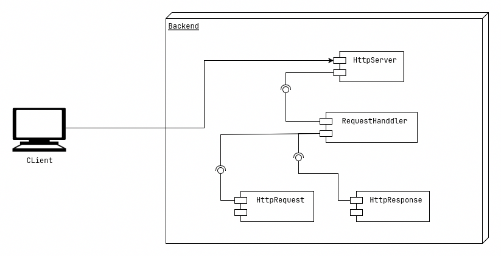
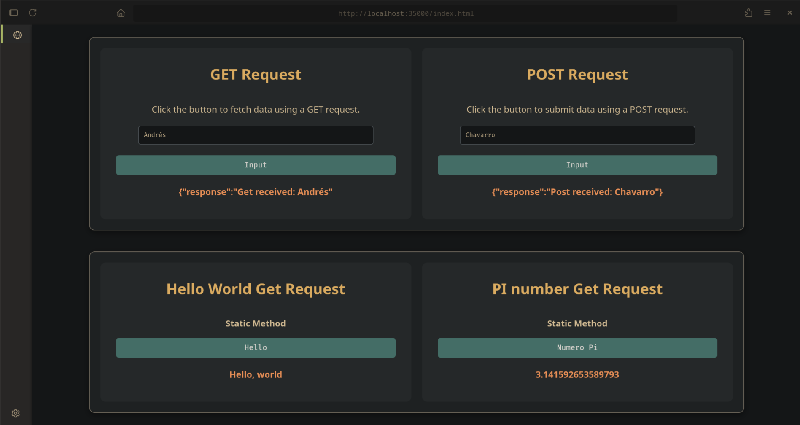
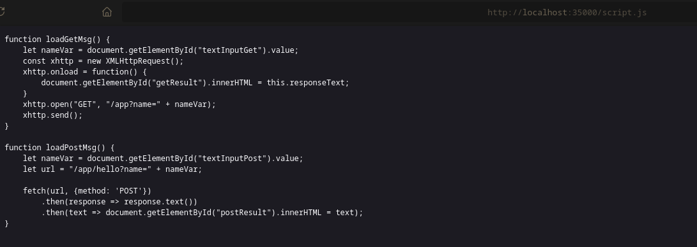
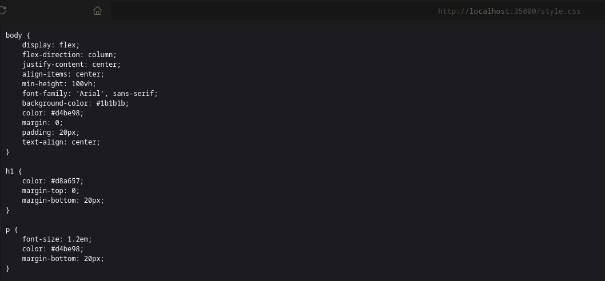
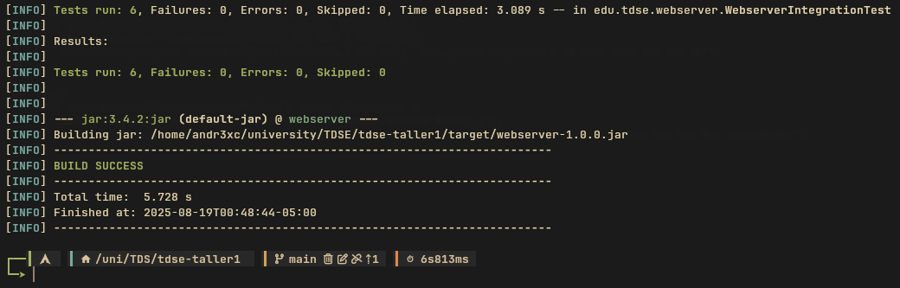

<div align="center">
<h1 align="center">Mini-Framework</h1>
<p align="center">
A minimalist, custom-built framework for rapid web service development.
</p>
</div>

</br>

## About
This project is a custom, lightweight full-stack framework designed for building modern web applications. It leverages a modular architecture to provide a cohesive environment for both RESTful API development and static asset serving.

Key features include:

- Declarative API Routing: Define REST endpoints using a clean, declarative syntax, mapping HTTP verbs to business logic handlers.
- Integrated Static File Server: Efficiently serve static assets such as HTML, CSS, JavaScript, and images with configurable root directories.
- Request & Response Middleware: A pipeline-based system for intercepting and modifying requests and responses, enabling functionalities like authentication, logging, and data validation.
- Dependency Injection: Manages service dependencies, promoting a decoupled and testable codebase.

Built with a focus on simplicity and performance, this framework aims to streamline the development of robust, maintainable, and scalable web services. It's an ideal foundation for rapid prototyping and production-ready microservices.

</br>
</br>

## Installation & usage

### Prerequisites

To run this server correctly, you need the following applications installed:
- Java
- Bash
- Git

</br>

### Installation

- Clone the repository and navigate into the project directory where the pom.xml is located:

```sh
git clone https://github.com/Andr3xDev/mini-framework
cd  mini-framework
```

- Build the project & run it:

```sh
mvn clean verify
java -jar target/framework-1.0.0.jar
```


The console should display the message of connection:
```
INFO: Server started on port: 35000
```

</br>
</br>

## Architecture

The core of this architecture is built around a central Request Handler. This component is solely responsible for processing incoming Request objects, routing them to the appropriate business logic, and ultimately generating and sending the final Response back to the client.



</br>
</br>

## Test Report

### Acceptance Tests

Manual acceptance tests were performed by requesting different resources to confirm they are served correctly, including:

- index.html



- script.js



- styles.css



- image1.png


- Not existing resources


</br>

### Unit Tests

There are a suite of integration tests validates server reliability by booting a live instance and sending real HTTP requests. These tests confirm that both static and API endpoints return the expected status codes, headers, and content, ensuring correct end-to-end behavior.

